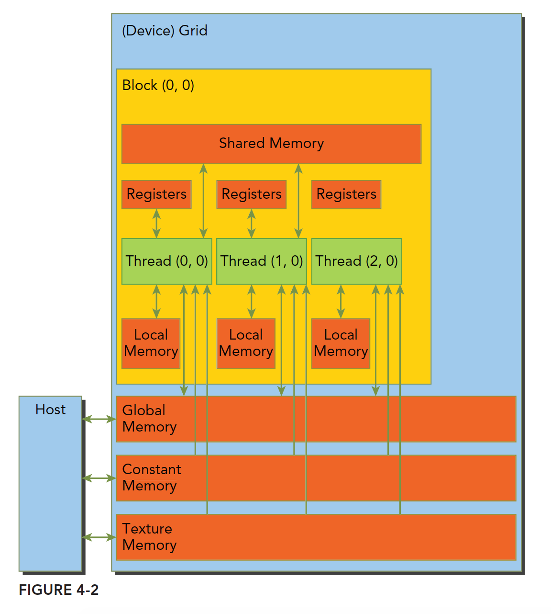
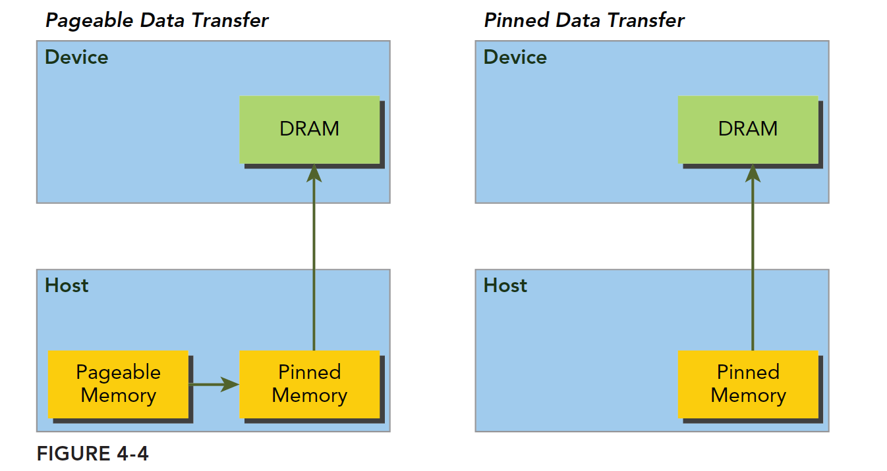
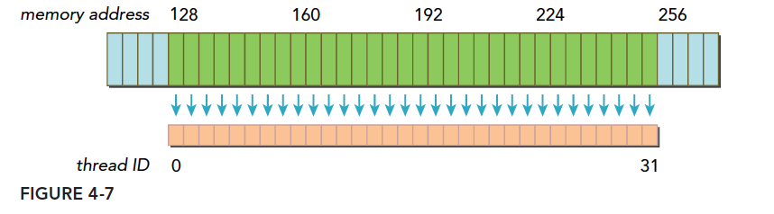
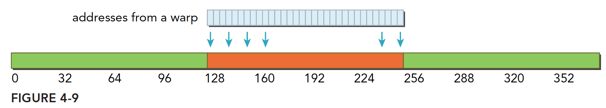
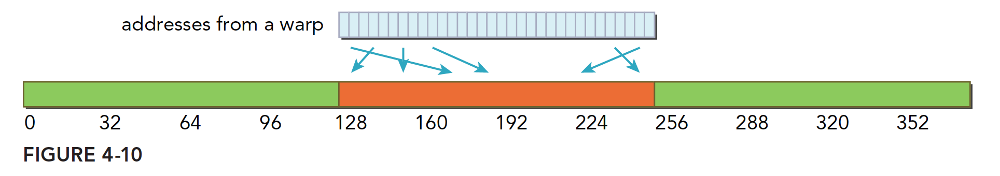
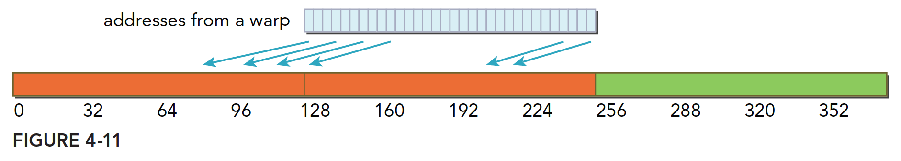
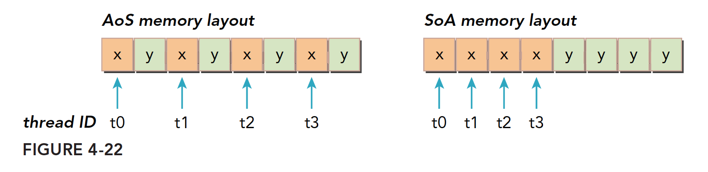
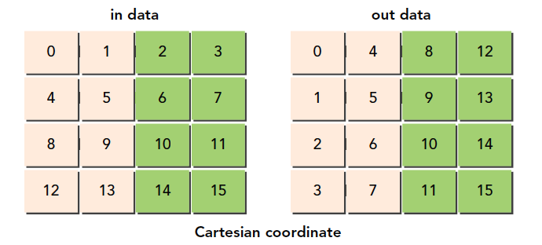

[ref]([GitHub - rightchose/CUDA_Freshman](https://github.com/rightchose/CUDA_Freshman))

因为SM有限，虽然我们的编程模型层面看所有线程都是并行执行的，但是在微观上看，所有线程块也是分批次的在物理层面的机器上执行，**线程块里不同的线程可能进度都不一样，但是同一个线程束内的线程拥有相同的进度。**

并行就会引起竞争，多线程以未定义的顺序访问同一个数据，就导致了不可预测的行为，**CUDA只提供了一种块内同步的方式，块之间没办法同步！**  
**同一个SM上可以有不止一个常驻的线程束，有些在执行，有些在等待，他们之间状态的转换是不需要开销的。**

**每个CUDA核心都有一个全流水的整数逻辑算数逻辑单元ALU，一个浮点运算单元FPU。**

每个SM包含1、执行单元（CUDA核）；2、调度线程束的调度器和调度单元；3、共享内存，寄存器文件和缓存。

每个多处理器SM有16个加载/存储单元所以每个时钟周期内有16个线程（半个线程束）计算源地址和目的地址

特殊功能单元SFU执行固有指令，如正弦，余弦，平方根和插值，SFU在每个时钟周期内的每个线程上执行一个固有指令。

**每个SM有两个线程束调度器，和两个指令调度单元，当一个线程块被指定给一个SM时，线程块内的所有线程被分成线程束，两个线程束选择其中两个线程束，在用指令调度器存储两个线程束要执行的指令，每16个CUDA核心为一个组，还有16个加载/存储单元或4个特殊功能单元。当某个线程块被分配到一个SM上的时候，会被分成多个线程束，线程束在SM上交替执行**

warp scheduler示意


多个warp，多个指令，可以看到实际执行时，执行的只是一个线程的部分，每次执行某个warp的某个指令。

**线程束和线程块**

线程束是SM中基本的执行单元，当一个网格被启动（网格被启动，等价于一个kernel被启动，每个kernel对应于自己的网格），网格中包含线程块，线程块被分配到某一个SM上以后，将分为多个线程束，每个线程束一般是32个线程（目前的GPU都是32个线程，但不保证未来还是32个）在一个线程束中，所有线程按照单指令多线程SIMT的方式执行，每一步执行相同的指令，但是处理的数据为私有的数据，下图反应的就是逻辑，实际，和硬件的图形化


在每个块中，每个线程有唯一的编号，threadIdx。

每个网格中，每个线程块也有唯一编号，blockIdx。

**线程束分化**

```cpp
if(conf)
{
    // do something
}
else
{
    // do something
}
```

假设这段代码是核函数的一部分，那么当一个线程束的32个线程执行这段代码的时候，如果其中16个执行if中的代码段，而另外16个执行else中的代码块，同一个线程束中的线程，执行不同的指令，这叫做线程束的分化。

我们知道在每个指令周期，线程束中的所有线程执行相同的指令，但是线程束又是分化的，所以这似乎是相悖的，但是事实上这两个可以不矛盾。  
解决矛盾的办法就是每个线程都执行所有的if和else部分，当一部分con成立的时候，执行if块内的代码，有一部分线程con不成立，那么他们怎么办？继续执行else？不可能的，因为分配命令的调度器就一个，所以这些con不成立的线程等待，就像分水果，你不爱吃，那你就只能看着别人吃，等大家都吃完了，再进行下一轮（也就是下一个指令）线程束分化会产生严重的性能下降。条件分支越多，并行性削弱越严重。如下图，if，else都做了执行。


因为线程束分化导致的性能下降就应该用线程束的方法解决，根本思路是**避免同一个线程束内的线程分化**，而让我们能控制线程束内线程行为的原因是**线程块中线程分配到线程束是有规律的而不是随机的。**

利用此可以写出两个性能完全不一样的kernel函数。假设，block的大小为64，，那么只有两个线程束。第一个kernel中，每个线程束内奇数线程执行else，偶数执行if。第二个kernel中，线程束1的tid编号为0~31，都执行if，线束2执行else。当然两个kernel的计算结果时不同的，但后期可以调整。

```cpp
__global__ void mathKernel1(float *c)
{
    int tid = blockIdx.x* blockDim.x + threadIdx.x;

    float a = 0.0;
    float b = 0.0;
    if (tid % 2 == 0)
    {
        a = 100.0f;
    }
    else
    {
        b = 200.0f;
    }
    c[tid] = a + b;
}
```

```cpp
__global__ void mathKernel2(float *c)
{
    int tid = blockIdx.x* blockDim.x + threadIdx.x;
    float a = 0.0;
    float b = 0.0;
    if ((tid/warpSize) % 2 == 0)
    {
        a = 100.0f;
    }
    else
    {
        b = 200.0f;
    }
    c[tid] = a + b;
}
```

线程束状态： 活跃，未激活、阻塞。取决于SM的资源·：1、程序计数器、寄存器、共享内存。

**线程束一旦激活来到片上，那么他就不会在离开SM直到执行结束**

活跃的线程束又分为：1、选定的线程束；2、阻塞的线程束；3、符合条件的线程束；

满足以下要求的线程束才是符合条件的：1、32个CUDA核心可以用于执行；2、执行所需要的资源全部就位；

**延迟隐藏**

GPU中对于指令的延迟通常分为两种：1、算术指令；2、内存指令；

**算数指令延迟**是一个算术操作从开始，到产生结果之间的时间，这个时间段内只有某些计算单元处于工作状态，而其他逻辑计算单元处于空闲

**内存指令延迟**很好理解，当产生内存访问的时候，计算单元要等数据从内存拿到寄存器，这个周期是非常长的。  
延迟：

- 算术延迟 10~20 个时钟周期
- 内存延迟 400~800 个时钟周期

**带宽和吞吐量**：带宽一般指的是理论峰值，最大每个时钟周期能执行多少个指令，吞吐量指实际操作过程中每分钟处理多少个指令。

提高并行的两种方法：

- 指令级并行（ILP）：一个线程中有很多独立的指令

- 线程级并行（TLP）：很多并发地符合条件的线程。

指令隐藏的关键目的是使用全部的计算资源，而内存读取的延迟隐藏是为了使用全部的内存带宽，内存延迟的时候，计算资源正在被别的线程束使用，所以我们不考虑内存读取延迟的时候计算资源在做了什么，这两种延迟我们看做两个不同的部门但是遵循相同的道理。

**同步**

CUDA中的同步：

- 线程块内同步

- 系统级别

**循环展开**

循环展开式一个尝试通过减少分支出现的频率和循环维护指令来优化循环的技术。

CUDA中展开循环的目的：

- 减少指令消耗

- 增加更多的独立调度指令

**动态并行**

动态并行相当于串行编程中的递归调用。CUDA编程中kernel调用kernel。早期的设备并不支持该功能。

动态并行的好处：让复杂的内核变得更有层次，坏处就是写出来的层序更复杂。

动态并行的另一个好处，等到执行的时候再配置创建多少个网格、多少个块，这样就可以动态地利用GPU硬件调度器和加载平衡器了。通过动态调整，来适应负载，并且在kernel中启动kernel可以减少一部分数据传输消耗。

kernel中启动kernel，类比到CPU上相似的概念父线程和子线程，子线程由父线程启动。GPU中涉及的概念要多一些，父网格、父线程块、父线程、对应的子网格、子线程块，子线程。子网格被父线程启动，且必须在对应的父线程，父线程块、父网格结束之前结束。所有的子网格结束后，父线程、父线程块、父网格才会结束。


**如果调用的线程没有显示同步启动子网格，那么运行时保证，父网格和子网格隐式同步。**

图中显式的同步了父网格和子网格，通过设置栅栏的方法。

父网格中的不同线程启动的不同子网格，这些子网格拥有相同的父线程块，他们之间是可以同步的。线程块中所有的线程创建的所有子网格完成之后，线程块执行才会完成。如果块中的所有线程在子网格完成前退出，那么子网格隐式同步会被触发。隐式同步就是虽然没用同步指令，但是父线程块中虽然所有线程都执行完毕，但是依旧要等待对应的所有子网格执行完毕，然后才能退出。

前面我们讲过隐式同步，比如cudaMemcpy就能起到隐式同步的作用，但是主机内启动的网格，如果没有显式同步，也没有隐式同步指令，那么cpu线程很有可能就真的退出了，而你的gpu程序可能还在运行，这样就非常尴尬了。

**动态并行的内存竞争**

- 父网格和子网络共享相同的全局和常量内存。

- 父网格子网格有不同的局部内存

- 有了子网格和父网格间的弱一致性作为保证，父网格和子网格可以对全局内存并发存取。

- 有两个时刻父网格和子网格所见内存一致：子网格启动的时候，子网格结束的时候

- 共享内存和局部内存分别对于线程块和线程来说是私有的

**内存层次结构的优点**

程序具有局部性特点：1、时间局部性；2、空间局部性；

**CUDA内存模型**

对于程序员而言， 内存可以分为1、可编程内存；2、不可编程内存。

CUDA内存结构中，一级和二级缓存都是不可编程的存储设备。

GPU的内存模型相对于CPU而言相当丰富，GPU的内存设备有：

- 寄存器

- 共享内存

- 本地内存

- 常量内存

- 纹理内存

- 全局内存

这些内存都有自己的作用域、生命周期、缓存行为。

- CUDA每个线程都有自己私有的本地内存；

- 线程块有着自己的共享内存，对线程块内所有线程可见。

- 所有线程都能访问和读取常量内存和纹理内存，但是不能写，只读。

- 全局内存，常量内存和纹理内存空间有不同的用途。

- 对于一个应用来说，全局内存、常量内存和纹理内存有着相同的生命周期。



**寄存器**

无论是在CPU还是GPU，寄存器都是速度最快的内存空间。但是GPU中的寄存器要多一些。

当我们在核函数内不加修饰的声明一个变量，此变量就存储在寄存器中。但是CPU运行的程序有些不同，只有当前在计算的变量存储在寄存器中，其余在主存中，使用时传输至寄存器。在核函数中定义的有常数长度的数组也是在寄存器中分配地址的。

寄存器对于每个线程是私有的，寄存器通常保存被频繁使用的私有变量。

**寄存器是SM中的稀缺资源**，Fermi架构中每个线程最多63个寄存器。Kepler结构扩展到255个寄存器，**一个线程如果使用更少的寄存器，那么就会有更多的常驻线程块，SM上并发的线程块越多，效率越高，性能和使用率也就越高。**

那么问题就来了，如果一个线程里面的变量太多，以至于寄存器完全不够呢？这时候寄存器发生溢出，本地内存就会过来帮忙存储多出来的变量，这种情况会对效率产生非常负面的影响，所以，不到万不得已，一定要避免此种情况发生。

为了避免寄存器溢出，可以在核函数的代码中配置额外的信息来辅助编译器优化

```c
__global__ void __lauch_bounds__(maxThreadaPerBlock,minBlocksPerMultiprocessor)
kernel(...) {
    /* kernel code */
}
```

这里面在核函数定义前加了一个 关键字 **lauch_bounds**，然后他后面对应了两个变量：

1. maxThreadaPerBlock：线程块内包含的最大线程数，线程块由核函数来启动
2. minBlocksPerMultiprocessor：可选参数，每个SM中预期的最小的常驻内存块参数。注意，对于一定的核函数，优化的启动边界会因为不同的结构而不同,也可以在编译选项中加入-maxrregcount=32，来控制一个编译单元里所有核函数使用的最大数量。

**Local Memory**

核函数中符合存储在寄存器中但不能进入核函数分配的寄存器空间中的变量将存储在local memory中，编译器可能存放在local memory中的变量有以下几种：

- 使用未知索引引用的本地数组

- 可能会占用大量寄存器空间的较大本地数组或者结构体

对于2.0以上的设备，本地内存存储在每个SM的一级缓存，或者设备的二级缓存上。

**Shared Memory**

在核函数中使用如下修饰符的内存，称为共享内存：

```c
__share__
```

每个SM都有一定数量的由线程块分配的共享内存（SM拥有的shared memory是线程块赋予的？），共享内存是片上内存，跟主存相比，速度要快很多，也即是延迟低，带宽高。其类似于一级缓存，但是可以被编程。

使用共享内存的时候一定要注意，不要因为过度使用共享内存，而导致SM上活跃的线程束减少，也就是说，一个线程块使用的共享内存过多，导致其他的线程块没办法被SM启动，这样影响活跃的线程束数量。（这里的理解是shared memory以线程块为单位申请，线程块执行时，以warp为单位，在SM上执行，多个线程块又构成了网格。共享内存的总量是定的，如果编程时，线程块申请的share memory过多，这些shared memory被SM使用，相应地，执行中的线程块就变少，线程束也会边少。）

共享内存在核函数内声明，生命周期和线程块一致，线程块运行开始，此块的共享内存被分配，当此块结束，则共享内存被释放。

**shared memory内存竞争问题**

shared memory块内线程是可见的，所以有竞争问题，也可以通过共享内存进行通信，为了避免内存竞争，可以使用同步语句：

```c
void __syncthread();
```

这个语句相当于线程块执行时，各个线程的一个障碍点，当块内所有线程都执行到本障碍点时，才能进行下一步计算，从而设计出避免共享内存竞争的程序。

但，`__syncthread();`频繁使用会影响内核执行效率。

**SM中的一级缓存，和shared memory共享一个64K片上内存（先前的设备），通过静态划分，划分彼此的容量。**

运行时，我们可以通过下面的语句进行设置。

```c
cudaError_t cudaFuncSetCacheConfig(const void *func, enum cudaFuncCache);
```

这个函数可以设置内核的共享内存和一级缓存之间的比。

cudaFuncCache参数可选如下配置：

```c
cudaFuncCachePreferNone//无参考值，默认设置
cudaFuncCachePreferShared//48k共享内存，16k一级缓存
cudaFuncCachePreferL1// 48k一级缓存，16k共享内存
cudaFuncCachePreferEqual// 32k一级缓存，32k共享内存
```

**Constant Memory**

常量内存驻留在设备内存中，每个SM都有专用的常量内存缓存，常量内存使用`__constant__`修饰。

常量内存在核函数外，全局范围内声明。对于所有设备，只可以声明64K的常量内存，并队同一编译单元中的所有核函数可见。

常量内存不能被核函数修改，但是可以被主机端代码初始化。

主机端代码通过下面的接口初始化常量内存。

```c
cudaError_t cudaMemcpyToSymbol(const void* symbol, const void *src, size_t count);
```

多数情况下，该函数时同步的，也就是马上会被执行。

当线程束中所有线程都从相同的地址取数据时，常量内存表现较好，比如执行一个多项式计算，系数都存在常量内存效率会很高。

常量内存的读取机制：一次读取会广播给所有线程束内的线程。

**纹理内存**

纹理内存驻留在设备内存中，在每个SM的只读缓存中缓存，纹理内存是通过指定的缓存访问的全局内存，只读缓存包括硬件滤波的支持，它可以将浮点插入作为读取过程中的一部分来执行，纹理内存是对二维空间局部性的优化。  
总的来说纹理内存设计目的应该是为了GPU本职工作显示设计的，但是对于某些特定的程序可能效果更好，比如需要滤波的程序，可以直接通过硬件完成。

**全局内存**

GPU上最大的内存空间，延迟最高，使用最常见的内存，global指的是作用域和生命周期，一般在主机端代码里定义，也可以在设备端定义，不过需要加修饰符，只要不销毁，是和应用程序同生命周期的。全局内存对应于设备内存，一个是逻辑表示，一个是硬件表示、

全局内存可以动态声明，或者静态声明，也可以用`__device__`在设备代码中静态地声明一个变量。

因为全局内存的性质，当有多个核函数同时执行的时候，如果使用到了同一全局变量，应注意内存竞争。

**GPU缓存**

与CPU缓存类似，GPU缓存不可编程，GPU上有四种缓存：1、一级缓存；2、二级缓存；3、只读常量缓存；4、只读纹理缓存。

 每个SM都有一个一级缓存，所有SM公用一个二级缓存。一级二级缓存被用来存储本地内存和全局内存中的数据，也包括寄存器溢出的部分。Fermi，Kepler以及以后的设备，CUDA允许我们配置读操作的数据是使用一级缓存和二级缓存，还是只使用二级缓存。

与CPU不同的是，CPU读写过程都有可能被缓存，但是GPU写的过程不被缓存，只有加载会被缓存！每个SM有一个只读常量缓存，只读纹理缓存，它们用于设备内存中提高来自于各自内存空间内的读取性能。

**总结**

| 修饰符            | 变量名称     | 存储器             | 作用域 | 生命周期 |
| -------------- | -------- | --------------- | --- | ---- |
|                | float    | 存储器             | 线程  | 线程   |
|                | float[]  | local memory    | 线程  | 线程   |
| \_\_shared\_\_ | float \* | shared memory   | 块   | 块    |
| \_\_device\_\_ | float \* | global memory   | 全局  | 应用程序 |
| \_\_constant   | float \* | constant memory | 全局  | 应用程序 |

| 存储器 | 片上/片外 | 缓存     | 存取  | 范围      | 生命周期 |
| --- | ----- | ------ | --- | ------- | ---- |
| 寄存器 | 片上    | n/a    | R/W | 一个线程    | 线程   |
| 本地  | 片外    | 1.0以上有 | R/W | 一个线程    | 线程   |
| 共享  | 片上    | n/a    | R/W | 块内所有线程  | 块    |
| 全局  | 片外    | 1.0以上有 | R/W | 所有线程+主机 | 主机配置 |
| 常量  | 片外    | Yes    | R   | 所有线程+主机 | 主机配置 |
| 纹理  | 片外    | Yes    | R   | 所有线程+主机 | 主机配置 |

**静态全局内存**

CUDA中有类似动态静态内存之分。动态分配`cudaMalloc`，静态分配`cudaMemcpyToSymbol`和`cudaMemcpyFromSymbol`。

**内存传输速度**


**固定内存**

在数据传输之前，CUDA驱动会锁定页面，或者直接分配固定的主机内存，将主机源数据复制到固定内存上，然后从固定内存传输数据到设备上。



如图，左边是正常分配内存，传输过程是：锁页-复制到固定内存-复制到设备。

右边是分配时就是固定内存，直接传输到设备。

固定内存的分配使用下面的语句：

```c
cudaError_t cudaMallocHost(void **devPtr, size_t count);
```

分配count字节的固定内存，这些内存是页面锁定的，可以直接传输到设备。

主机的固定内存释放使用下面的语句：

```c
cudaError_t cudaFreeHost(void *ptr);
```

固定内存的释放和分配成本比可分页内存要高很多，但是传输速度更快，所以对于大规模数据，固定内存效率更高。

**零拷贝内存**

内存知识的基础都是：主机直接不能访问设备内存，设备不能直接访问主机内存。对于早期设备，这是肯定的，但是后来，一个例外出现了——零拷贝内存。

GPU线程可以直接访问零拷贝内存，这部分内存在主机内存里面，CUDA核函数使用零拷贝内存有以下几种情况：

- 当设备内存不足的时候可以利用主机内存。

- 避免主机和设备之间的显式内存传输。

- 提高PCIe传输率

现在主机和设备可以同时访问同一个设备地址，不可避免地产生主机和设备的内存竞争。

零拷贝内存是固定内存，不可分页，可以通过下面的函数创建零拷贝内存：

```c
cudaError_t cudaHostAlloc(void **pHost, size_t count, unsigned int flags)
```

最后一个标志参数可以选择下面的值：

`cudaHostAllocDefault`：和cudaMallocHost函数一致。

`cudaHostAllocPortable`：返回能被所有CUDA上下文使用的固定内存。

`cudaHostAllocWriteCombined`：返回写结合内存，在某些设备上，这种内存传输效率更高。

`cudaHostAllocMapped`产生零拷贝内存。

注意，零拷贝内存虽然不需要显式的传递到设备上，但是设备还不能通过pHost直接访问对应的内存地址，设备需要访问主机上的零拷贝内存，需要先获得另一个地址，这个地址帮助设备访问到主机对应的内存，方法是：

零拷贝内存可以当做比设备主存储器更慢的一个设备。

**统一虚拟寻址**

统一寻址方式（UVA）：设备内存和主机内存呗映射到同一虚拟内存地址中。


UVA之前，我们要管理所有的设备和主机内存，尤其是他们的指针，零拷贝内存尤其麻烦，很容易乱的，写过c的人都知道，弄个五六个指针在哪其中一部分还指向相同的数据不同的地址的，十几行之后必然会混乱。有了UVA再也不用怕，一个人一个名，走到哪里都能用，通过UVA，cudaHostAlloc函数分配的固定主机内存具有相同的主机和设备地址，可以直接将返回的地址传递给核函数。

UVA代码主要就是差个获取指针，UVA可以直接使用主机端的地址。

**统一内存寻址**

CUDA6.0的时候又来了个统一内存寻址，提出的目的也是为了简化内存管理。

**统一内存中创建了一个托管内存池（CPU上有，GPU上也有），内存池中已分配的空间可以通过相同的指针直接被CPU和GPU访问。** 底层系统在统一的内存空间中自动的进行设备和主机间的传输。数据传输对应用是透明的，大大简化了代码。

其实就是搞个内存池，这部分内存用一个指针同时表示主机和设备内存地址，依赖于UVA但是是完全不同的技术。

统一内存寻址提供了一个“指针到数据”的编程模型，概念上类似于零拷贝，但是零拷贝内存的分配是在主机上完成的，而且需要互相传输，但是统一寻址不同。

托管内存是指底层系统自动分配的统一内存，未托管内存就是我们自己分配的内存，这时候对于核函数，可以传递给他两种类型的内存，已托管和未托管内存，可以同时传递。

托管内存的分配方式：

```c
cudaError_t cudaMallocManaged(void **devPtr, size_t size, unsinged int flags=0)
```

#### 内存访问

多数GPU程序容易收到内存带宽的限制，所以最大程度的利用全局内存带宽，提高全局加载效率。

CUDA执行的基本单位是线程束，所以内存访问也是以线程束为基本单位发布和执行的，存储也一致。访问包含LD和ST。

**对齐与合并访问**


全局内存是一个逻辑层面的模型，编程时有两种模型考虑，逻辑层面：我们写的一维（多维）数组，结构体。定义的变量，这些都是在逻辑层面的。硬件层面：就是一块DRAM上的电信号，以及最底层的内存驱动代码所完成的数字信号处理。

L1表示一级缓存，**每个SM都有自己的L1，但L2是所有SM公用的**，除了L1缓存外，还有只读缓存和常量缓存。

核函数运行时需要从全局内存（DRAM）中读取数据，只有两种粒度，：

- **128字节**

- **32字节**

具体时32字节还是128字节需要看访问方式：

- 使用一级缓存

- 不使用一级缓存

对于CPU来说，一级二级缓存是不可编程的，但CUDA是支持通过编译指令停用一级缓存，如果启用一级缓存，那么每次从DRAM上加载数据的粒度是128字节。如果不适用一级缓存，只是用二级缓存，那么粒度是32字节。

还要强调一下CUDA内存模型的内存读写，我们现在讨论的都是单个SM上的情况，多个SM只是下面我们描述的情形的复制：SM执行的基础是线程束，也就是说，当一个SM中正在被执行的某个线程需要访问内存，那么，和它同线程束的其他31个线程也要访问内存，这个基础就表示，即使每个线程只访问一个字节，那么在执行的时候，只要有内存请求，至少是32个字节，所以不使用一级缓存的内存加载，一次粒度是32字节而不是更小。

在优化内存的时候，我们最要关注的两个特性：

- 对齐内存访问

- 合并内存访问

**我们把一次内存请求——也就是从内核函数发起请求，到硬件响应返回数据这个过程称为一个内存事务（加载和存储都行）。**

**当一个内存事务的首个访问地址是缓存粒度（32或128字节）的偶数倍的时候：比如二级缓存32字节的偶数倍64，128字节的偶数倍256的时候，这个时候被称为对齐内存访问，非对齐访问就是除上述的其他情况，非对齐的内存访问会造成带宽浪费。**

这里也类似CPU中，访问内存时，会额外读取一些数据，如果这些数据后续的程序能够使用，能大大加快程序运行。也就是局部性。

当一个线程束内的线程访问的内存都在一个内存块里的时候，就会出现合并访问。

对齐合并访问的状态是理想化的，也是最高速的访问方式，当线程束内的所有线程访问的数据在一个内存块，并且数据是从内存块的首地址开始被需要的，那么对齐合并访问出现了。为了最大化全局内存访问的理想状态，尽量将线程束访问内存组织成对齐合并的方式，这样的效率是最高的。下面看一个例子。

- 一个线程束加载数据，使用一级缓存，并且这个事务所请求的所有数据在一个128字节的对齐的地址段上（对齐的地址段是我自己发明的名字，就是首地址是粒度的偶数倍，那么上面这句话的意思是，所有请求的数据在某个首地址是粒度偶数倍的后128个字节里），具体形式如下图，这里请求的数据是连续的，其实可以不连续，但是不要越界就好。



上面蓝色表示全局内存，下面橙色是线程束要的数据，绿色就是我称为对齐的地址段。

- 如果一个事务加载的数据分布在不一个对齐的地址段上，就会有以下两种情况：
  
  1. 连续的，但是不在一个对齐的段上，比如，请求访问的数据分布在内存地址1~128，那么0~127和128~255这两段数据要传递两次到SM
  2. 不连续的，也不在一个对齐的段上，比如，请求访问的数据分布在内存地址0~63和128~191上，明显这也需要两次加载


 **全局内存读取**

读取这里指的是LD。

SM加载数据，根据不同的设备和类型分为三种途径：

1、一级和二级缓存

2、常量缓存

3、只读缓存

常规的途径为一级和二级缓存，需要使用常量和只读缓存的需要在代码中显式声明。

控制全局加载操作是否通过一级缓存可以通过编译选项来控制。

编译器禁用一级缓存选项

```shell
-Xptxas -dlcm=cg
```

启用一级缓存

```shell
-Xptxas -dlcm=ca
```

当一级缓存被禁用的时候，对全局内存的加载请求直接进入二级缓存，如果二级缓存缺失，则由DRAM完成请求。

每次内存事务可由一个两个或者四个部分执行，每个部分有32个字节，也就是32，64或者128字节一次。

启用一级缓存后，当SM有全局加载请求会首先通过尝试一级缓存，如果一级缓存缺失，则尝试二级缓存，如果二级缓存也没有，那么直接DRAM。  
在有些设备上一级缓存不用来缓存全局内存访问，而是只用来存储寄存器溢出的本地数据，比如Kepler 的K10,K20。

内存访问有以下特点：

- 是否使用缓存：一级缓存是否介入加载过程

- 对齐与非对齐的：如果访问的第一个地址是32的倍数

- 合并与非合并，访问连续数据块则是合并的

**缓存加载**

1、对齐合并的访问，利用率100%



2、对齐的，但是不连续，但每个线程访问的数据都在一个块内，位置是交叉的，利用率100%。



3、连续非对齐，线程束请求一段连续的非对齐数据，数据横跨两个块，启用一级缓存时候，，需要两个128字节的事务来完成。



4、线程束所有线程请求同一个地址，那么肯定落在一个缓存范围。按照请求4字节来说，利用率就4/128=3.125%。


5、最坏的情况1/N。


**没有缓存的加载**

没有缓存的加载指的是没有通过一级缓存，二级缓存则是不得不经过的。

当不使用一级缓存的时候，内存事务的粒度为32字节。


**只读缓存**

只读缓存最初是留给纹理内存加载用的，在3.5以上的设备，只读缓存也支持使用全局内存加载代替一级缓存。也就是说3.5以后的设备，可以通过只读缓存从全局内存中读数据了。

只读缓存粒度32字节，对于分散读取，细粒度优于一级缓存

有两种方法指导内存从只读缓存读取：

- 使用函数 \_ldg

- 在间接引用的指针上使用修饰符

```c
__global__ void copyKernel(float * in,float* out)
{
    int idx=blockDim*blockIdx.x+threadIdx.x;
    out[idx]=__ldg(&in[idx]);

}
```

**结构体数组和数组结构体**

数组结构体（aos）：是一个数组，元素为结构体。

结构体数组（soa）：是一个结构体，成员为数组。

二者的内存布局如下。并行编程中，尤其是SIMD对soa更友好。



**性能调整**

优化设备内存带宽利用率有两个目标：

- 对齐合并内存访问，以减少带宽的浪费

- 足够的并发内存操作，以隐藏内存延迟

也就是，内存对齐，提高利用率；并发要多，隐藏内存延迟。

### 核函数可达到的带宽

**内存带宽**

带宽分为：理论带宽、有效带宽。

理论带宽也就是硬件设计的最大值，硬件限制了这个最大值为多少。

有效带宽就是核函数实际达到的带宽，是测量带宽，可以用下面的公式计算：

$$
有效带宽=\frac {(读字节数+写字节数)\times 10 ^{-9}} {运行时间}
$$

**矩阵转置问题**


二者的内存布局如下：


程序上，读取原始矩阵数据，放入转置的矩阵单元中。转置操作有以下特点：

- 读：原矩阵进行读取，请求的内存是连续的，可以进行合并访问。

- 写：写道转置矩阵时，访问是交叉的。

在程序编写上，对于矩阵，我们是横向处理还是纵向处理很关键。如图


按照行处理方式，读的时候，一次读取一行的数据，随后交叉访问转置矩阵的，将结果写入。

按照列的处理方式，读取的时候，一次交叉读取一列数据，随后可以直接写入转置矩阵结果中。

对于内存LD时，可以经过一级缓存，按照行的方式，虽然处理第一列时，要多次读取，但读取数据会缓存到一级缓存中，后续的列就不在需要了；写的时候不需要经过一级缓存，直接写入。列的方式好在能缓存LD的结果，其实没有额外的读开销。看似交叉LD，但结果会被缓存。

而按照行的方式，处理时一次读取一行，写入时交叉写入（多次写入）。但写入并没有缓存可以利用。

读取时可以利用一级缓存，写入最好合并写入，而不要交叉。

**对角转置**

在DRAM中内存是分区规划的，如果过多的访问同一个区，就会产生排队的现象，就需要等待。为了避免这种情况，我们最好均匀的访问DRAM的某一段，DRAM的分区是每256个字节算一个分区，所以我们最好错开同一个分区的访问，方法就是调整块的ID，

而使用对角矩阵的目的是使得读取的DRAM位置均匀一点，都别集中在一个分区上，方法是打乱线程块，因为连续的线程块可能访问相近的DRAM地址。

我们的方案是使用一个函数 $f(x,y)=(m,n)$ 一个一一对应的函数，将原始笛卡尔坐标打乱。

老的计算，in data和out data的线程id。



使用对角转置后


**统一内存矩阵加法**

统一内存编程上相较于手动而言是可以减少一些代码量。

总结：

虽然统一内存管理给我们写代码带来了方便而且速度也很快，但是实验表明，手动控制还是要优于统一内存管理，换句话说，人脑的控制比编译器和目前的设备更有效，所以，为了效率，大家还是手动控制内存吧，把命运掌握在自己手里。


**CUDA共享内存概述**

共享内存通常的用途有：1、块内线程通信的通道；2、用于全局内存数据的可编程管理的缓存；3、告诉暂存存储器，用于转换数据来优化全局内存访问模式。

**共享内存（shared memory，SMEM）** 是GPU的一个关键部分，物理层面，每个SM都有一个小的内存池，这个线程池被次SM上执行的线程块中的所有线程所共享。共享内存使同一个线程块中可以相互协同，便于片上的内存可以被最大化的利用，降低回到全局内存读取的延迟。

GPU中存在
