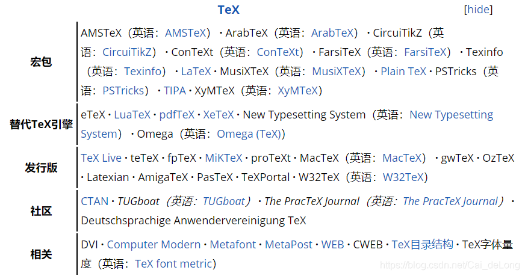

#### 编译tex文件的步骤
[参考](https://wenda.latexstudio.net/article-5016.html)
1、纯英文文档使用pdflatex编译
```
pdflatex main.tex
```
2、中文文档并且使用ctex宏集
```
xelatex main.tex
```
3、正反向搜索需要添加参数`-synctex`，并生成`.synctex.gz`文件。
```
pdflatex -synctex=1 main.tex
```
4、编译有参考文献的tex文件
```
pdflatex main.tex
bibtex main.tex
pdflatex main.tex
pdflatex main.tex
```
`latexmk`可以简化这一过程
```
latexmk -pdf main.tex
```
同样`latexmk`也支持参数。
```
latexmk -pdf -synctex1 main.tex
```

#### LaTex、pdflatex、xelatex、xetex等的区别和联系
[参考](https://blog.csdn.net/Cai_deLong/article/details/113970205)
**Tex**:一种宏语言。基于宏的流行的文本格式化程序,TeX提供了一套功能强大并且十分灵活的排版语言，它多达900多条指令，并且TeX有宏功能，用户可以不断地定义自己适用的新命令来扩展TeX系统的功能。许多人利用TeX提供的宏定义功能对TeX进行了二次开发，其中比较著名的有美国数学学会推荐的非常适合于数学家使用的AMS-TeX以及适合于一般文章、报告、书籍的LaTeX系统。
**LaTex**:是一种基于TEX的排版系统。LaTeX使用TeX作为它的格式化引擎。LaTeX遵循呈现与内容分离的设计理念，它鼓励从内容中分离布局，同时仍然允许在需要时进行手动排版调整。LaTeX系统是一种可以处理排版和渲染的标记语言。
**Tex和LaTex的关系**
LaTeX 是TeX 中的一种格式(format) ，是建立在TeX 基础上的宏语言，也就是说，每一个LaTeX 命令实际上最后都会被转换解释成几个甚至上百个TeX 命令。

**自底向上**

首先是**宏包**：
- Plain Tex： Tex中的一个最基本的宏集合与TeX的基础语言构成的一种格式。
- LaTex： Tex中的一个宏集合，构成一种与 Plain TeX 不一样的格式。
-  Latex命令：tex命令加上某一个选项使用，就会用LaTeX 格式进行排版，也就是说此时后面跟的tex文件应该是用LaTex格式写的。可以理解为tex 命令与对应编译选项合的快捷别名，叫latex命令。

  
然后是**替代引擎**：
- Tex程序：把Tex语言转换为排版的程序，也叫Tex。为区别，称这个 TeX 程序叫Knuth TeX。

- Tex命令：Tex程序中的编译命令。tex命令默认用Plain TeX格式进行排版。也就是说tex命令后面默认跟的tex文件应该是用Plain Tex格式写的。

- pdfTeX程序：Tex语言的一个实现，也就是把Tex语言转换为排版的又一个程序。它会把 TeX 语言写的代码直接编译成 PDF 文件。

  - pdftex命令：pdfTex程序中的命令，用来编译用Plain TeX格式写的tex文件。

  - pdflatex命令：pdfTex程序中的命令，用来编译用LaTeX格式写的tex文件。

- XeTeX程序：TeX语言的新的实现，即把Tex语言转换为排版的一个新程序。支持Unicode 编码和直接访问操作系统字体。
  - xetex命令：XeTeX程序中的命令，用来编译用Plain TeX格式写的tex文件。

  - xelatex命令：XeTeX程序中的命令，用来编译用LaTeX格式写的tex文件。
最后是**发行版**
常见的有TeX Live、MiKTeX等